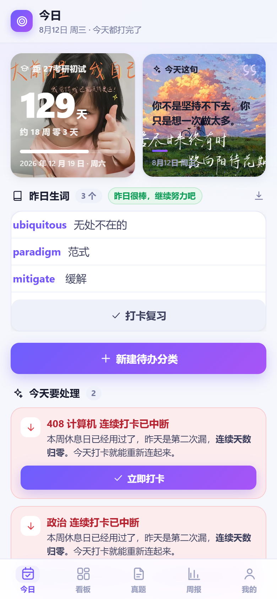
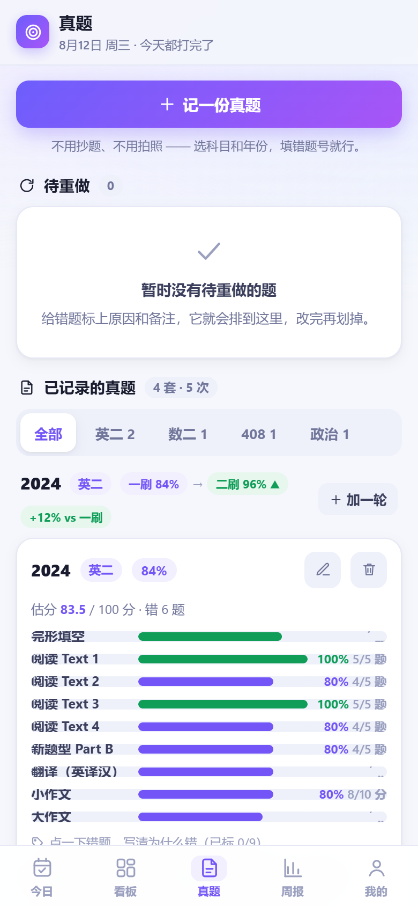
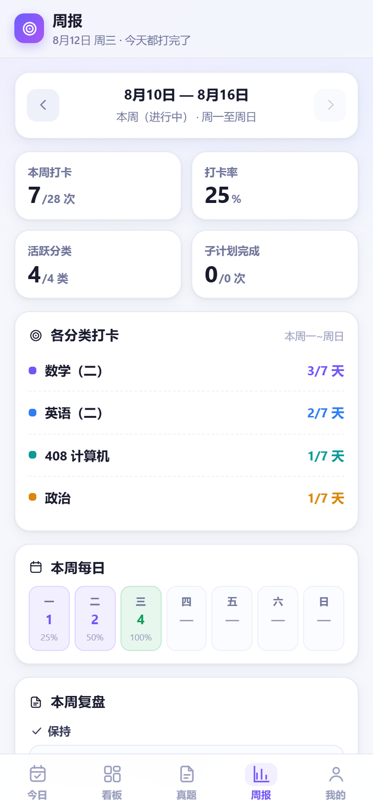
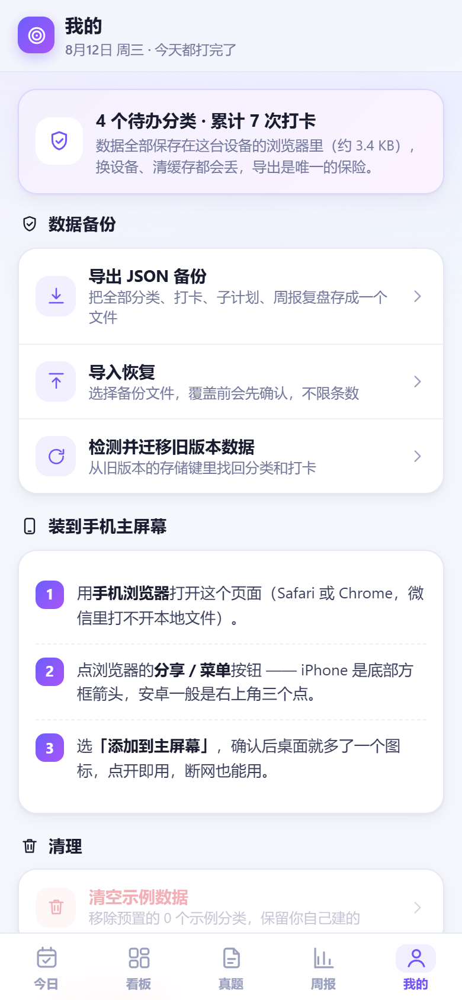

# 学习目标管理台 / Study Goal Manager

一个纯本地、零安装的学习打卡与备考管理工具，专为考研 / 考证人群设计。打开网页即可使用，也支持安装为手机全屏 App。

## 功能特性

- 每日打卡与目标管理：按分类记录每天学了什么，支持打卡总览与周报汇总
- 真题生词分层：记录真题生词，按「昨日生词 / 已记生词」分层回顾，版块可折叠
- 真题多轮次练习：按题号记录，支持一刷 / 二刷 / 三刷，自动对比各轮正确率变化
- 周报自动生成：复盘不费脑
- 数据备份与迁移：支持导出 / 导入 JSON，换设备、换浏览器不丢数据

## 亮点

- 单文件网页应用：零依赖、零后端，浏览器打开即用
- 支持 PWA 安装：手机「添加到主屏幕」即可变成全屏 App，体验接近原生
- 完全离线、本地存储：数据只存在于你自己的浏览器，不上传任何服务器
- 开源免费

## 使用方法

1. 打开网址：https://wantangfeng.github.io/studygoal/
2. （可选）在手机浏览器打开后，使用「安装为应用 / 添加到主屏幕」功能，将其安装为全屏 App
3. 开始记录你的学习与打卡

数据备份：进入「我的」→「数据备份」可导出 JSON 备份，或导入之前导出的备份文件。

## 截图预览

### 今日 · 打卡与生词

### 真题 · 多轮次练习（一刷 / 二刷 / 三刷）

### 周报

### 我的 · 设置与数据备份

## 技术说明

- 纯前端实现（HTML + CSS + JavaScript），无框架、无构建步骤
- 数据持久化使用浏览器 localStorage
- 通过 manifest.webmanifest + service worker 实现 PWA 安装能力
- 单文件结构，便于自托管与修改

## 隐私

本应用不收集、不上传任何用户数据。所有数据仅存储在使用者本地浏览器中。仓库代码公开，不含任何个人数据。

## License

MIT
